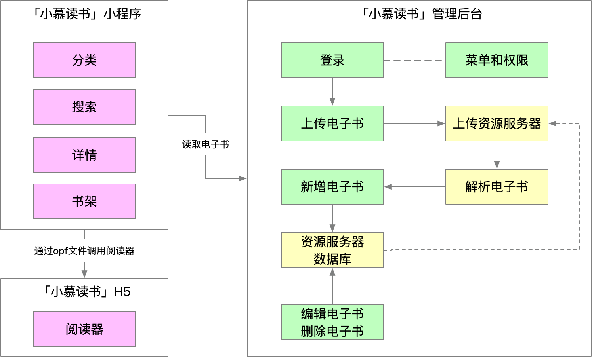
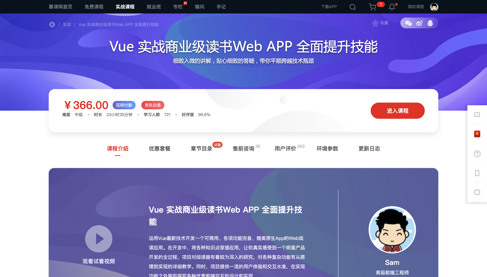
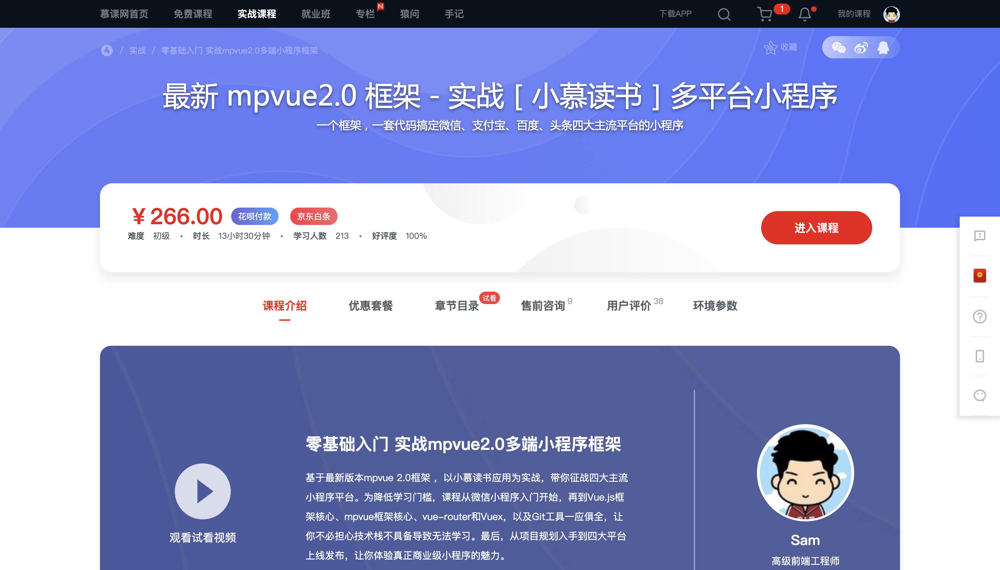

# 课程说明

## 课程心路

很多同学都在期待这门课程，大家希望通过管理后台自主上传电子书，但由于这个功能较为复杂，经过数月的筹备，这门课程终于与大家见面了。这门课程将贯穿前两门课程，形成功能闭环。

这门课程的难度是三门课程中最大的，中后台技术本来就比较复杂，涉及登录、token 认证、异常处理、界面框架等等，再加上电子书解析，涉及 epub 的原理、xml 解析、zip 解压、文件上传等等诸多技术点，所以这门课的难度是空前的，学习这门课程需要持续的积累和坚持，但我相信每一位慕课网的用户都是非常优秀的，大家一定可以完成这门课程，完成预期的学习目标。

## 「小慕读书」系列课程介绍

### 系列课程一：「小慕读书」H5

「小慕读书」H5 是我的第一门实战课，它是基于 Vue 实现的 H5 项目，它最核心的部分是实现了一个电子书阅读器，同时它也实现了阅读器配套的书城、书架和详情等功能

[访问](https://coding.imooc.com/class/285.html)课程

### 系列课程二：「小慕读书」小程序

「小慕读书」小程序是我的第二门实战课，它基于 mpvue 实现了一个阅读小程序，小程序支持访问我们在本课程中上传的电子书

[访问](https://coding.imooc.com/class/376.html)课程

### 系列课程三：「小慕读书」管理后台

「小慕读书」管理后台是系列课程中承上启下的一部，它的核心功能是实现了电子书的上传和解析，完成了自定义电子书的录入，这是非常令人兴奋的功能

### 系列课程四：（筹备中）

::: tip
系列课程的内容希望得到你的反馈，欢迎通过邮件与我联系：247765564@qq.com
:::

## 关于 Vue 3.0

关于课程最大的学习困扰是 Vue 3.0 即将发布，我们是否该继续学习 Vue 2.0 呢？答案是必须的。

- 首先，Vue 3.0 推出到完善需要一个过程，因为现在 Vue 的生态都是基于 Vue 2.0 的，这个生态整体升级到 Vue 3.0 需要一个较为漫长的过程；
- 其次，Vue 3.0 自身完善也需要一个过程，不建议在早期就将生产项目迁移到 Vue 3.0，框架自身也需要经历一个迭代过程。

那么是否及时学习 Vue 3.0 呢？答案也是必须的，Vue 3.0 代表更新的前端理念和更高的运行效率，所以是必须学习的。课程将在 Vue 3.0 更新后快速跟进迭代，所以购买课程的同学无需担心。所以综合来说 Vue 2.0 和 Vue 3.0 都将是 Vue 开发者必须掌握的选项。

## 学习技巧

前端工程师的职业成长通常需要经历以下四个阶段：

- 初级工程师（对应薪资：5000-1w）：初步掌握前端开发，技术栈比较局限；
- 中级工程师（对应薪资：1w-2w）：技术栈进一步丰富，对实现细节不清楚；
- 高级工程师（对应薪资：2w-3w）：清楚实现细节，不再局限某一技术栈；
- 专家工程师（对应薪资：3w-4w）：灵活运用各种技术，解决复杂的技术问题。

:::tip
薪资标准参考一线城市大型互联网公司收入水平
:::

前端工程师最大的陷阱是"会用就行"，抱有这类想法会大大制约我们的成长，这类同学的成长瓶颈会卡在中级工程师，往往会感觉一身本领，但却无法进一步晋升。本课程希望能够帮助初级或中级工程师往更高的等级跃迁，不仅希望教会大家实际的开发技能，而是希望通过源码部分的解读和原理的讲解，带领大家建立良好的前端学习习惯。
